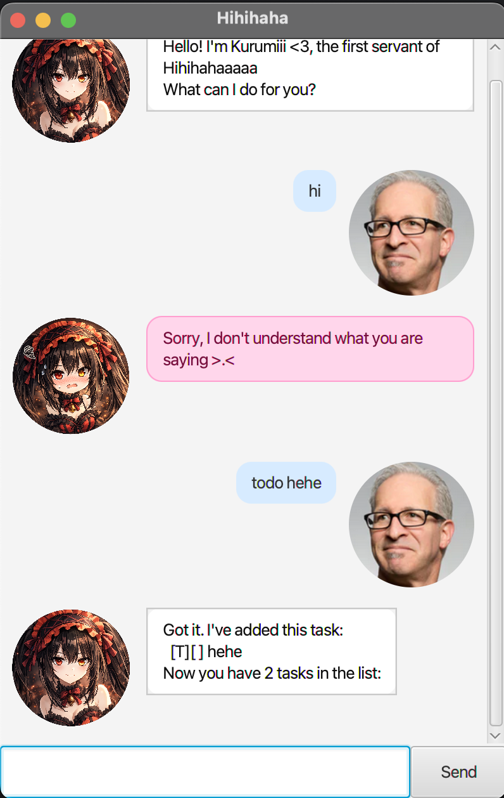

# Hihihaha User Guide



Hihihaha is a lightweight task-tracking chatbot with a GUI.

It supports:

* Todos
* Deadlines (date only)
* Events (date range)
* Marking/unmarking tasks as done
* Finding tasks by keyword
* A simple reminder list for upcoming deadlines

---

## Quick start

1. Ensure you have **Java 17** installed.
2. Download the latest release JAR (a **fat JAR**) and place it in any folder.
3. Run the app:

   ```bash
   java -jar hihihaha.jar
   ```

4. Type commands into the input box and press **Enter** (or click **Send**).

Hihihaha automatically saves your tasks to `data/task.txt` when you exit.

---

## Command summary

Notes:

* Task indices shown by `list` start from **1**.
* Dates must follow the format **`dd-MM-yyyy`** (e.g., `20-11-2022`).
* Words in `{braces}` are placeholders.

| What you want to do | Command format | Example |
|---|---|---|
| Add a todo | `todo {description}` | `todo read book` |
| Add a deadline | `deadline {description} /by {dd-MM-yyyy}` | `deadline return book /by 20-11-2022` |
| Add an event | `event {description} /from {dd-MM-yyyy} /to {dd-MM-yyyy}` | `event concert /from 20-11-2022 /to 21-11-2022` |
| List tasks | `list` | `list` |
| Mark as done | `mark {index}` | `mark 1` |
| Mark as not done | `unmark {index}` | `unmark 1` |
| Delete a task | `delete {index}` | `delete 2` |
| Find tasks by keyword | `find {keyword}` | `find book` |
| Show upcoming deadlines | `remind` | `remind` |
| Exit the app | `bye` | `bye` |

---

## Features

### Adding a todo: `todo`

Adds a todo task.

Example:

```
todo read book
```

### Adding a deadline: `deadline`

Adds a deadline task with a **date**.

Example:

```
deadline return book /by 20-11-2022
```

### Adding an event: `event`

Adds an event task with a **from** date and a **to** date.

Example:

```
event concert /from 20-11-2022 /to 21-11-2022
```

### Listing tasks: `list`

Shows all tasks with their indices.

Example:

```
list
```

### Marking tasks: `mark` / `unmark`

Marks an existing task as done (or not done).

Examples:

```
mark 1
unmark 1
```

### Deleting tasks: `delete`

Deletes a task by its index.

Example:

```
delete 2
```

### Finding tasks: `find`

Shows tasks containing a keyword in their description.

Example:

```
find book
```

### Reminders: `remind`

Shows deadlines that are upcoming.

Example:

```
remind
```

### Exiting: `bye`

Typing `bye` closes the app and saves your tasks.

---

## Data storage

Hihihaha stores tasks in a plain text file at:

* `data/task.txt`

If the file or folder does not exist, Hihihaha will create it automatically.
